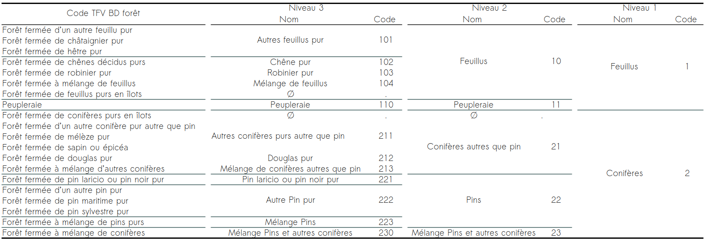
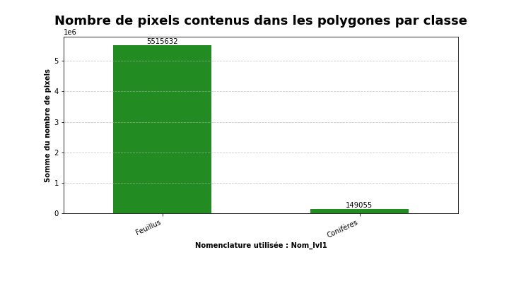
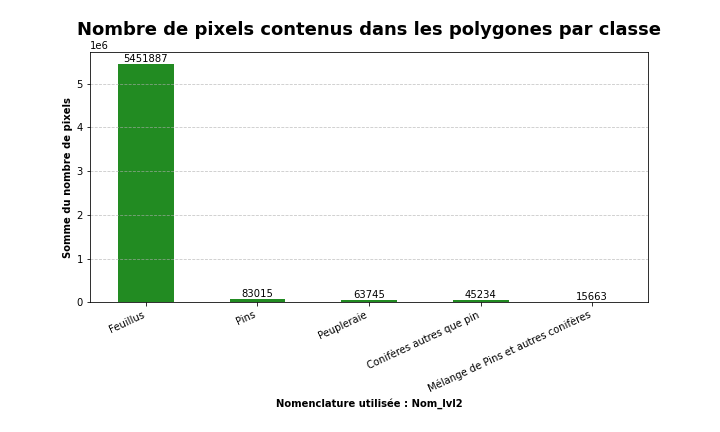
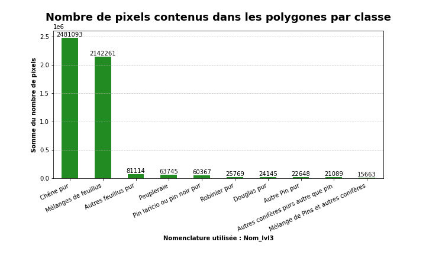

# Sample Analysis
The samples contains **3 nomenclatures** levels like below :

**Overall, the distribution of samples is very unbalanced, whatever the nomenclature level.**

## Level 1 
Over the 10,748 polygons used as level 1 samples, more than 97% of the polygons are hardwood, with more than 97% of the pixels out of a total of more than 5.6 million level 1 pixels. The ratio between class 1 polygons remains very unbalanced. 
On the other hand, for every 1 pixel described in the Hardwood class, there are 37 pixels described as Hardwood.

## Level 2
This trend remains similar in the polygons and pixels described in class 2. Of the 11,159 polygons in this class, more than 92% are classified as Hardwood, with more than 96% of the pixels out of more than 5.6 million pixels covered by level 2.

## Level 3 
As for class 3, the imbalance between the two types of species is also identical. The majority of polygons are classified as Hardwood, more specifically 49% as Mixed Hardwood (43% of pixels) and more than 40% as Pure Oak (50% of pixels) out of a total of 5,377 polygons for 4.9 million pixels covered by this class.

