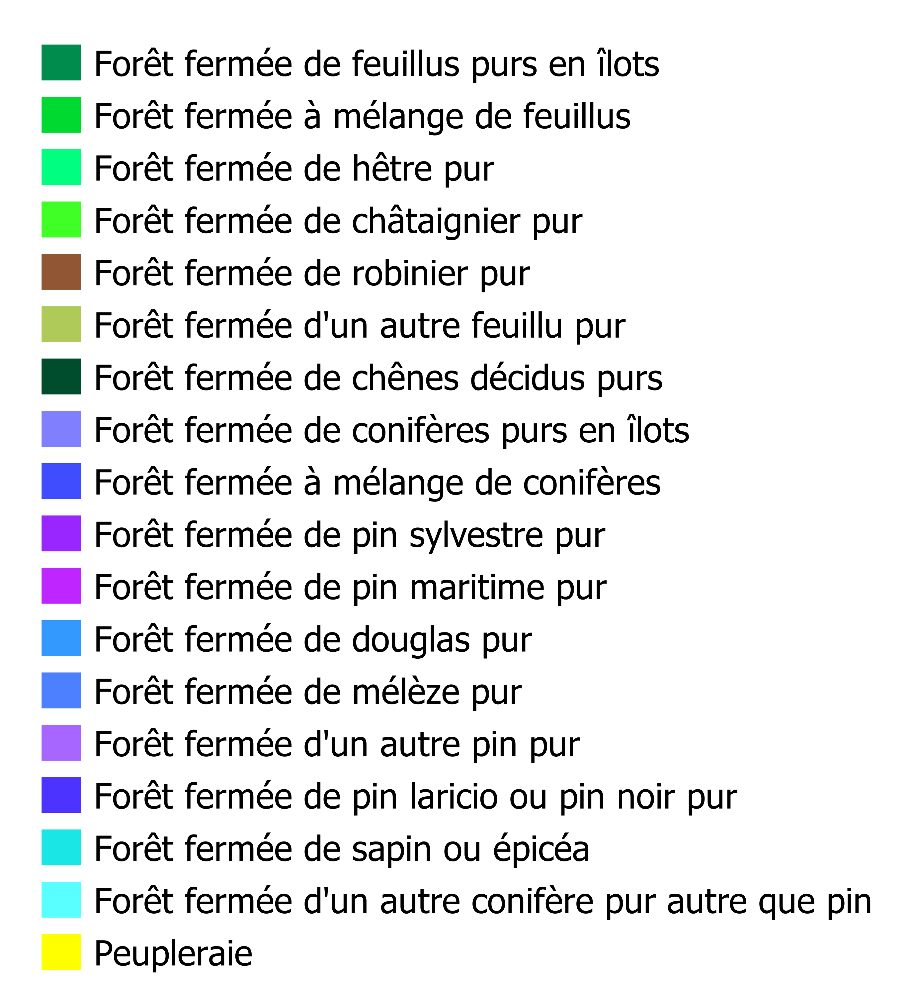

# Runtime API Examples

This page demonstrates usage of some of the runtime APIs provided by VitePress.

The main `useData()` API can be used to access site, theme, and page data for the current page. It works in both `.md` and `.vue` files:

```js
<script setup>
import { useData } from 'vitepress'

import 'leaflet/dist/leaflet.css';

import L from 'leaflet';

const { theme, page, frontmatter } = useData()
</script>

## Results

### Theme Data
<pre>{{ theme }}</pre>

### Page Data
<pre>{{ page }}</pre>

### Page Frontmatter
<pre>{{ frontmatter }}</pre>
```

<script setup>
import { useData } from 'vitepress'

import { onMounted, reactive, ref } from 'vue'

import 'leaflet/dist/leaflet.css';

import L from 'leaflet';

const { site, theme, page, frontmatter } = useData()

onMounted(() => {
  // Création d'une carte Leaflet dont relié à l'id html 'map' qui a comme coordonnées 
  var map = L.map('map').setView( [43.3, 1.4], 10);

var osm = L.tileLayer('https://tile.openstreetmap.org/{z}/{x}/{y}.png', {
    attribution: '&copy; <a href="https://www.openstreetmap.org/copyright">OpenStreetMap</a> contributors'
}).addTo(map);
var ortho = L.tileLayer.wms('https://wxs.ign.fr/ortho/geoportail/r/wms', {
    layers: 'ORTHOIMAGERY.ORTHOPHOTOS.BDORTHO'
}).addTo(map);

var bd_forest = L.tileLayer.wms('https://wxs.ign.fr/environnement/geoportail/r/wms', {
    layers: 'LANDCOVER.FORESTINVENTORY.V2',
    attribution: '&copy; IGN BD_forêt',
    transparent: true,
    format: 'image/png',
    
});


var result_cla = L.tileLayer.wms('https://www.geotests.net/geoserver/m_joffrion/wms', {
    layers: 'lvl2_from_lvl3',
    transparent: true,
    format: 'image/png'
}).addTo(map);

console.log("url", result_cla);

var baseMaps = {
    'OpenStreetMap': osm,
    'Otho-imagery': ortho,
};

var overlayMaps = {
    'Carte forestière (2006-...' : bd_forest,
    'Resultat Nomenclature 2' : result_cla
};

    //Add forest Legend
    var legend_simple = L.control({position: 'bottomleft'});
    legend_simple.onAdd = function (map) {

      let divlegend = L.DomUtil.create('divlegend', 'info legend');
      divlegend.innerHTML = ('<div>  Forest legend <br>'+
      ''+
      '</div>');
      return divlegend;
      };
    legend_simple.addTo(map);

    
    // var overlayMaps = { 
    //     'Parcelles': parcels_f, 
    //     'Parcelles nues' : parcels_nu,
    //     'Parcelles Divisibles': parcels_divisible
    // };

    L.control.layers(baseMaps,overlayMaps).addTo(map);

  });


</script>

::: info
<a href="https://joffrion.alwaysdata.net/site-pro/data/index_webmap.html" target="_blank">Link to fullscreen map</a>
:::

## Results

::: details My map
```js
var map = L.map('map').setView([51.505, -0.09], 13);

L.tileLayer('https://tile.openstreetmap.org/{z}/{x}/{y}.png', {
    attribution: '&copy; <a href="https://www.openstreetmap.org/copyright">OpenStreetMap</a> contributors'
}).addTo(map);

L.marker([51.5, -0.09]).addTo(map)
    .bindPopup('A pretty CSS popup.<br> Easily customizable.')
    .openPopup();
```

```html
<div id="map" style="height: 180px"></div>
```
:::


<html>
<body>
<div id="map" class="mapleaflet" style="height: 500px;width: 100%; "></div>
</body>
</html>

::: details forest legend

:::

### Theme Data
<pre>{{ theme }}</pre>

### Page Data
<pre>{{ page }}</pre>

### Page Frontmatter
<pre>{{ frontmatter }}</pre>

## More

Check out the documentation for the [full list of runtime APIs](https://vitepress.dev/reference/runtime-api#usedata).
