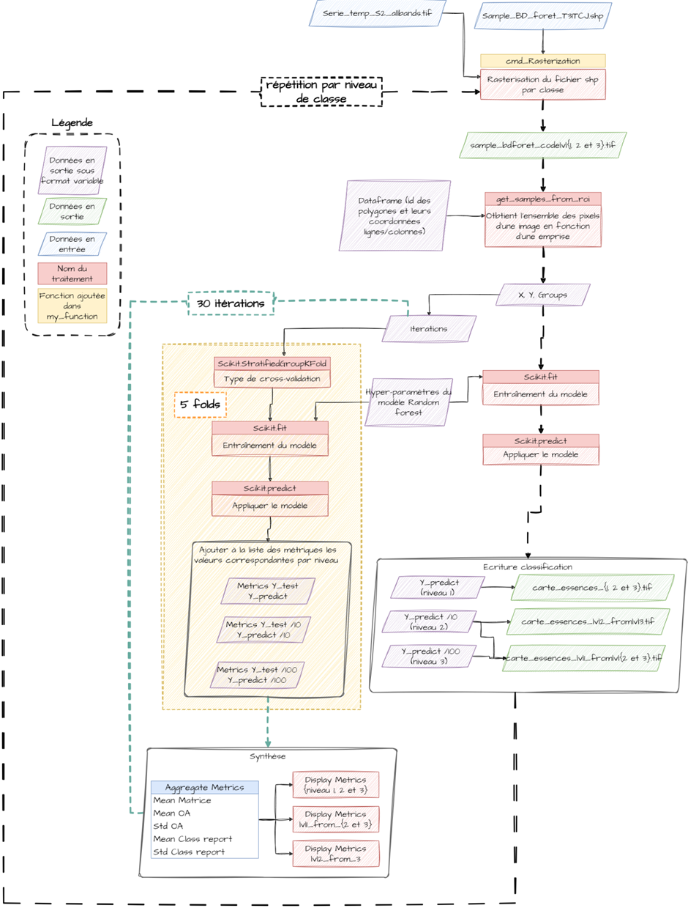
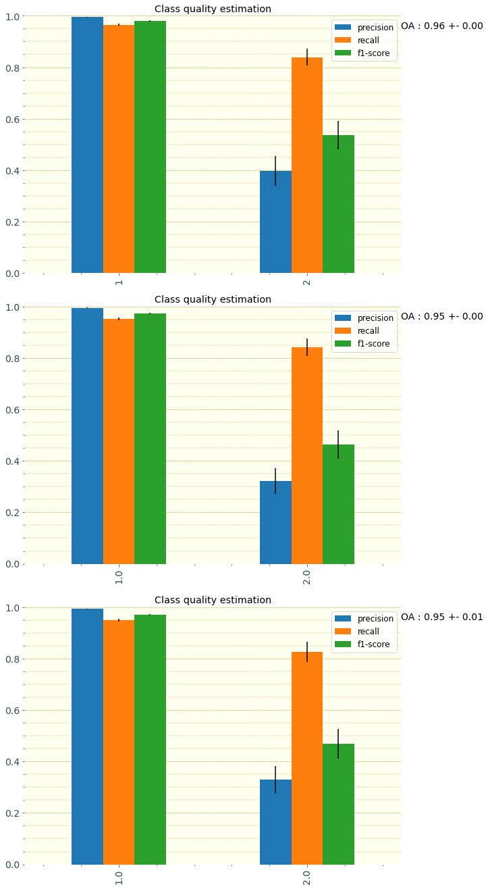
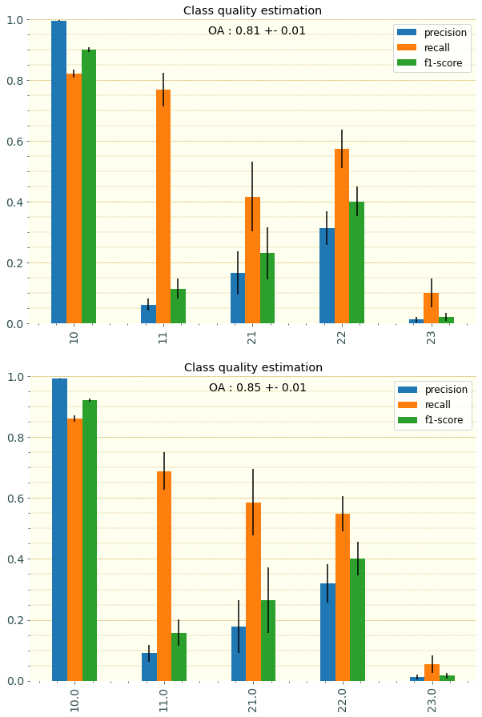
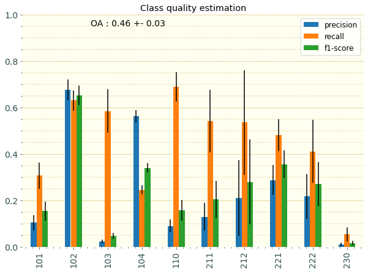

# Classification
## General Method

This part of the project is much more complicated, mainly because it implies a lot of technical quality evaluation. The main script uses Scikit-learn.

::: tip Scikit-learn
 It's an open source machine learning library that supports supervised and unsupervised learning. It also provides various tools for model fitting, data preprocessing, model selection, model evaluation, and many other utilities.
:::

In order to assess the quality of the model as accurately as possible, a stratified 5-fold cross-validation was used, taking into account the polygon membership of the pixels, repeated 30 times with aggregated results. 
The hyper-parameters used in the Random Forest are below: 
```py
RandomForest(
            max_depth=10,
            oob_score=True,
            max_samples=.75,
            class_weight='balanced',
            n_estimators=20,
            n_jobs=-1
            )
```
The groups are obtained by rasterizing the sample layer by **ID**.
Once the groups have been obtained, a loop is started which iterates over the number of nomenclature defined (3 in our case). 
This loop is performed in the following order:
- rasterization of samples for the current nomenclature (by level)
- extraction of spectral values from the source image for raster format samples (X,y,t)
::: details
    X being all spectals values from all dates as array
    y being the level to predict as array, like '22' -> Pins
    t a tuple containing all the informations needed to rewrite the image
:::
- recovery of groups by joining the groups (id of polygons) found in the nomenclature level
- initiation of a loop for a defined number of iterations (30): 
  - initiation of a loop over 5 kfolds : 
    - initiation of an identical Random Forest model
    - split into train and test sets
    - training the model
    - application of the model to the test set
    - validation by comparing the predicted test set and the truth
    - Various metrics are added to respective lists
    - if the nomenclature is of type Code_lvl2 or Code_lvl3, the aggregated metrics are obtained by validating the prediction divided by 10 or 100 and rounded down to zero with the truth divided by 10 or 100 and rounded down to zero
- averages the various metrics obtained 
- displays and saves the various aggregated metrics
::: details
- 1 averaged confusion matrix
- 1 graph showing the quality of the different classes 
:::
- re-train the Random Forest with the complete (X,Y)
- all the spectral values of the source image are put into the form of an X_img matrix
- the model predicts the nomenclatures Y_img
- if the nomenclature is of type Code_lvl2 or Code_lvl3, the prediction is divided by 10 or 100 and rounded down to zero 
- the various predictions obtained are written in **.TIF** format

**This sums up graphically like below:**



## Evaluation Loop

```py 
# Iter on stratified K fold
    for _ in range(nb_iter): # nb_iter = 30
      kf = StratifiedGroupKFold(n_splits=nb_folds, shuffle=True)

      for train, test in kf.split(X, Y, groups=grps_niv):
          X_train, X_test = X[train], X[test]
          Y_train, Y_test = Y[train], Y[test]
          
          # 3 --- Train
          clf = RandomForest(
                            max_depth=10,
                            oob_score=True,
                            max_samples=.75,
                            class_weight='balanced',
                            n_estimators=20,
                            n_jobs=-1
                            )
          clf.fit(X_train, Y_train)

          # 4 --- Test
          Y_predict = clf.predict(X_test)
          
          # 5 --- Evaluate
          if field_name == nomencalture[2] :
              #level 2
              Y_predict_lvl2 = np.floor(Y_predict/10)

              Y_test_lvl2 = np.floor(Y_test/10)
              # compute quality
              list_cm_lvl2.append(confusion_matrix(Y_test_lvl2, Y_predict_lvl2))
              list_accuracy_lvl2.append(accuracy_score(Y_test_lvl2, Y_predict_lvl2))
              report_lvl2 = classification_report(Y_test_lvl2, Y_predict_lvl2,
                                             labels=np.unique(Y_predict_lvl2),
                                             output_dict=True)
              list_report_lvl2.append(f.report_from_dict_to_df(report_lvl2))
              
              #level 1
              Y_predict_lvl1 = np.floor(Y_predict/100)
              Y_test_lvl1 = np.floor(Y_test/100)
              # compute quality
              list_cm_lvl1.append(confusion_matrix(Y_test_lvl1, Y_predict_lvl1))
              list_accuracy_lvl1.append(accuracy_score(Y_test_lvl1, Y_predict_lvl1))
              report_lvl1 = classification_report(Y_test_lvl1, Y_predict_lvl1,
                                             labels=np.unique(Y_predict_lvl1),
                                             output_dict=True)
              list_report_lvl1.append(f.report_from_dict_to_df(report_lvl1))

          if field_name == nomencalture[1] :
              #level 1
              Y_predict_lvl1 = np.floor(Y_predict/10)
              Y_test_lvl1 = np.floor(Y_test/10)
              # compute quality
              list_cm_lvl1.append(confusion_matrix(Y_test_lvl1, Y_predict_lvl1))
              list_accuracy_lvl1.append(accuracy_score(Y_test_lvl1, Y_predict_lvl1))
              report_lvl1 = classification_report(Y_test_lvl1, Y_predict_lvl1,
                                             labels=np.unique(Y_predict_lvl1),
                                             output_dict=True)
              list_report_lvl1.append(f.report_from_dict_to_df(report_lvl1))
              

          # compute quality
          list_cm.append(confusion_matrix(Y_test, Y_predict))
          list_accuracy.append(accuracy_score(Y_test, Y_predict))
          report = classification_report(Y_test, Y_predict,
                                         labels=np.unique(Y_predict),
                                         output_dict=True)
          # store them        
          list_report.append(f.report_from_dict_to_df(report))

``` 

Once this loop is done for one level, it displays the **charts** and the **final raster prediction** is written.

## Results  
::: warning General results
It seems like, when a class needs to be detected but is also found in an aggregated class at the same level, it leads to confusion. For example, in level 2: the **Pines** and **Mixed Pines** class. In this case, the classes share common behaviours that make it difficult to discriminate them correctly.

Aggregation seems beneficial in this case. The finer nomenclature makes it possible to identify the behaviours of the different species. This done, it allows the aggregated nomenclature to appear more clearly, and therefore it helps to discriminate one class from a mixed neighbouring class.

However, this hypothesis does not explain why grouping does not improve the results for level 1. It seems that in cases where the classes are already very distinct from one another (Conifers have a phenology that is very distinct from Hardwoods), combining upper level does not lead to clarification and may even degrade the quality of the predictions by adding unnecessary complexity.
:::
### Level 1 

In general and in details the level 1 without superior level aggregation is better.
The common dynamic remains the same in all predictions, with very good precision and recall for the **Hardwood** :deciduous_tree:,class anf for the **Conifer** :evergreen_tree: class, the results are worth it, with correct recall but a lot of confusion.


::: details Class quality estimation
Respectively level 1;
level 1 from level 2 aggregation;
level 1 from level 3 aggregation;


:::
### Level 2 
On the opposite, the level 2 obtained with superior level aggregation is better. In this case, the benefits of aggregation could be significant.
**Hardwoods** remain the most detected and least confused class. Confirmed **Poplar stands** are correctly detected but the prediction is almost systematically confused with Hardwoods.

As far as Conifers are concerned, **Pines** showed the best results with a lot of confusion. 
The **Conifers other than Pines** class appears less well performed than the **Pines**, but with similar dynamics. 
The **Mixed Pines** and Other Conifers class showed the worst results, due to its sample size of less than 16k pixels and the difficulty of distinguishing it from the Pines and Other Conifers class.

::: details Class quality estimation
Respectively level 2;
level 2 from level 3 aggregation;


:::

### Level 3
The overall quality of model 3 is very average, with an OA of 0.46.
Most of the confusion occurred in the Pure Oak and Mixted Hardwood classes.
::: details Class quality estimation

:::

