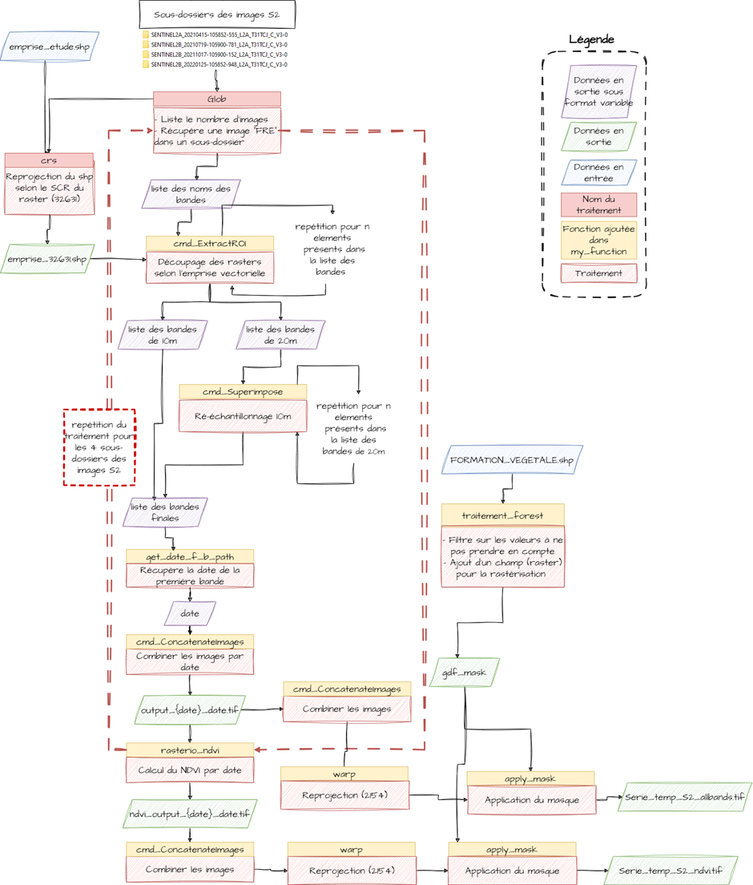

# Pre-processing Sentinel 2 data

## Data source

The main purpose of this part of the projet is to obtain a time series of Sentinel-2 images. The list of source images is obtained by applying some filters.

::: details Selection criteria

- Acquired between January 2021 and February 2022 ;
- From the T31TCJ tile (which corresponds to Toulouse and the surrounding area);
- Less than 15% cloud cover ( information  available in the image properties section of the catalogue);
- reflectance images (level 2A);
- 6 images :
  - 1 date in winter ;
  - 4 dates in autumn/spring, ideally two for each season;
  - 1 date in summer.
- Flat Reflectance images only

::: 

## Pre processing chaine

Flowchart explaing the different steps below :



Besides names and directory manipulation the chain mainly rest on 5 functions applied at different moments

**At the end of the process we are getting 1 image containing 6 bands (1 NDVI for each of the dates) and 1 image of 60 bands (10 per date)**

### OTB Functions

::: tip Orfeo ToolBox (OTB) 
it's an open-source project for state-of-the-art remote sensing. It can process high resolution optical, multispectral and radar images. A wide variety of applications are available.
:::
OTB functions are CMD called from the python script.
Those functions are just string constructors with the given correct argument and paths.

- **Sub-image extraction** from a vector source ROI (Region Of Interest)
```py 
def cmd_ExtractROI(input_img, extraction_vector, output_raster):
    '''

    Parameters
    ----------
    input_img : STR
        DESCRIPTION : input raster
    extraction_vector : STR
        DESCRIPTION : ref vector
    output_raster : STR
        DESCRIPTION.

    Returns
    -------
    None.

    '''
    otbcli_ExtractROI = f'{otb_bin_path}/otbcli_ExtractROI.bat'
    cmd = (f'{otbcli_ExtractROI}  -mode fit -mode.fit.vect {extraction_vector}'
           f' -in {input_img} -out {output_raster} int16 -ram {RAM}')
    os.system(cmd)


```
- **Re-sampling** image from a reference image
```py 
def cmd_Superimpose(inr, inm, output_raster):
    '''

    Parameters
    ----------
    inr : STR
        DESCRIPTION : input raster
    inm : STR
        DESCRIPTION : ref image
    output_raster : STR
        DESCRIPTION.

    Returns
    -------
    None.

    '''
    otbcli_Superimpose = f'{otb_bin_path}/otbcli_Superimpose.bat'
    cmd = (f'{otbcli_Superimpose} -inr {inr} -inm {inm} -interpolator nn'
           f' -out {output_raster} int16 -ram {RAM}')
    os.system(cmd)

```
- **Concatenate** images from a list of images path
```py 
def cmd_ConcatenateImages(list_image, output_concat, type=None):
    '''

    Parameters
    ----------
    list_image : STR
        DESCRIPTION.
    output_concat : STR
        DESCRIPTION.
    type : STR OPTIONAL

    Returns
    -------
    None.

    '''
    if type == None: type = 'int16'
    list_image_str = ' '.join(list_image)
    otbcli_ConcatenateImages = f'{otb_bin_path}/otbcli_ConcatenateImages.bat'
    cmd = (f'{otbcli_ConcatenateImages} -il {list_image_str}'
           f' -out {output_concat} {type} -ram {RAM}')
    os.system(cmd)


```

### Rasterio Functions
::: tip Rasterio
A dedicate raster data python library
:::

Rasterio function are slightly more complexes. 
- Comput the **NDVI** (Normalized Difference Vegetation Index)
```py 
def rasterio_ndvi (file_path, red, pir):
    '''

    Parameters
    ----------
    file_path : STR
        DESCRIPTION.
    red : INT
        DESCRIPTION.
    pir : INT
        DESCRIPTION.

    Returns
    -------
    ndvi_path : STR
        DESCRIPTION.

    '''
    raster = rasterio.open(file_path)
    rdir = os.path.dirname(file_path)
    rname = os.path.basename(file_path)
    
    rouge = raster.read(red)
    nred = raster.read(pir)
    rouge = rouge.astype('float32')
    nred = nred.astype('float32')
    ndvi = (nred - rouge) / (nred + rouge)
    
    destination_meta = raster.profile
    destination_meta['count'] = 1
    destination_meta['dtype'] = "float32"
    
    raster_sortie = rasterio.open(f'{rdir}/ndvi_{rname}', 'w', **destination_meta)
    raster_sortie.write(ndvi, 1)
    ndvi_path = f'{rdir}/ndvi_{rname}'
    raster.close
    
    return ndvi_path


```
- Apply a vector **mask** to a multi-band image
```py 
def apply_mask (fp_in_image, fp_out_image, gdf_mask):
    '''

    Parameters
    ----------
    fp_in_image : STR
        DESCRIPTION.
    fp_out_image : STR
        DESCRIPTION.
    gdf_mask : Geodataframe
        DESCRIPTION.

    Returns
    -------
    None.

    '''
    
    gdf_mask = gdf_mask.dissolve()
    
    with rasterio.open(fp_in_image) as source:
        emprise = gdf_mask.to_crs(source.crs)
        out_image, out_transform = mask(source, emprise.geometry,crop=True)
        out_meta = source.meta.copy() 
        out_meta.update({"driver": "GTiff", 
                     "height": out_image.shape[1], 
                     "width": out_image.shape[2],
                     "transform": out_transform,
                     'nodata': '0'})
        source.close()
        
    with rasterio.open(fp_out_image, "w", **out_meta) as destination:
        destination.write(out_image)
        destination.close()

```


