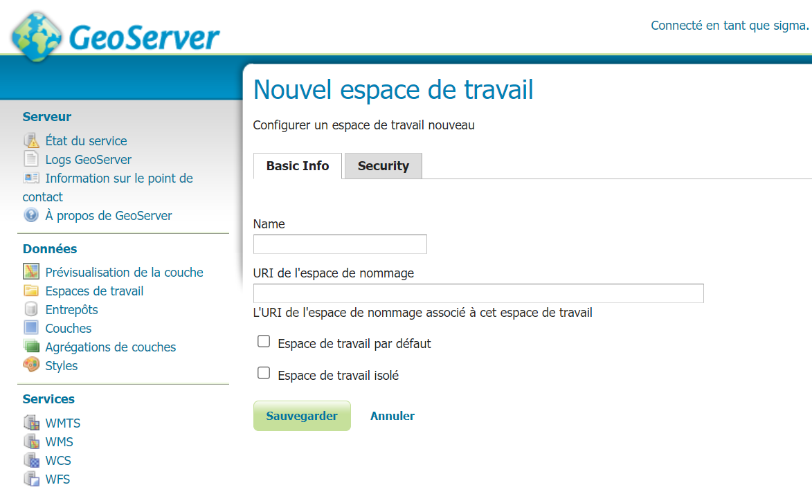
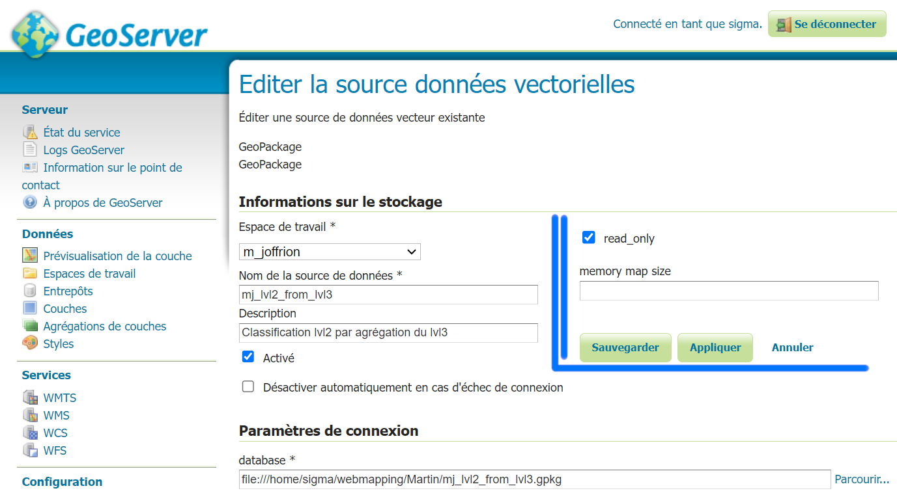
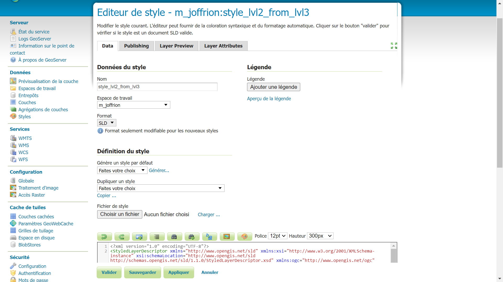

# Generate Web service using Geoserver

## Upload and vectorize data
I've made the choice to vectorize our .tif classification output :
 - It offers more options once uploaded on the server (WFS & WMS)
 - Keeps more informations
 - Is lighter to store

## Create Working-directory and Store
Once the vector data, here a .gpkg (geopackage), is uploaded, we can get connected to this data by creating a store. However, firstly, this store needs his own **working-directory**. 

#### Create a store and connect to vector data source
With the working-directory created, we can now create the **store** that will support the data.

## Deal with style and publish layer
With Geoserver you can actually handles styles on the interface. 
It means that you can create a style directly from the Geoserver interface or **upload** a style file. The style file needs to be a **.sld style** which is XML written.
It can be obtained on QGIS for instance, by exporting the style of a layer.

Once the style is created it simply needs to be apply to the published layer.

